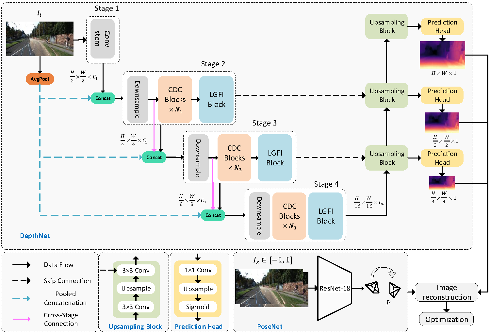
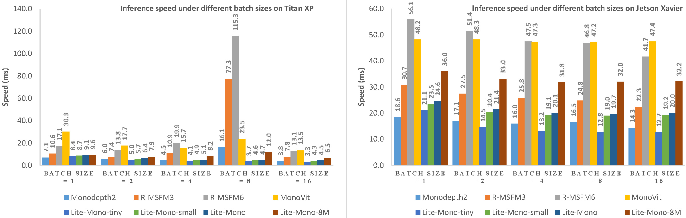
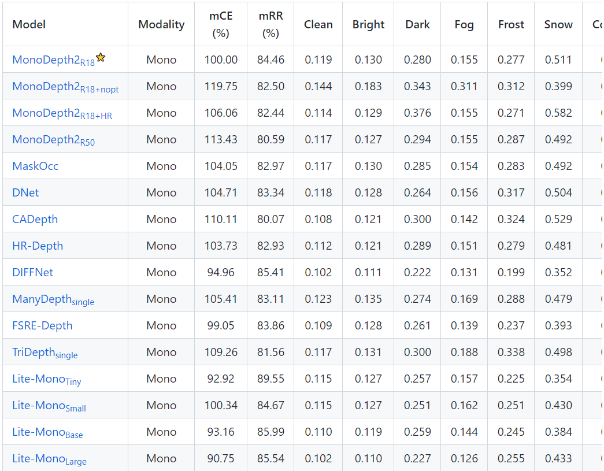

# Lite-Mono 
**A Lightweight CNN and Transformer Architecture for Self-Supervised Monocular Depth Estimation**
  [[paper link]](https://arxiv.org/abs/2211.13202)

  Ning Zhang*, Francesco Nex, George Vosselman, Norman Kerle

  

(Lite-Mono-8m 1024x320) 

## Table of Contents
- [Overview](#overview)
- [Results](#results)
  - [KITTI](#kitti) 
  - [Speed Evaluation](#speed-evaluation)
  - [Robustness](#robustness)
- [Data Preparation](#data-preparation)
- [Single Image Test](#single-image-test)
  - [Preparing Trained Model](#preparing-trained-model)
  - [Start Testing](#start-testing)
- [Evaluation](#evaluation)
- [Training](#training)
  - [Dependency Installation](#dependency-installation)
  - [Preparing Pre-trained Weights](#preparing-pre-trained-weights)
  - [Start Training](#start-training)
  - [Tensorboard Visualization](#tensorboard-visualization)
- [Make Your Own Pre-training Weights On ImageNet](#make-your-own-pre-training-weights-on-imagenet)
- [Citation](#citation)

## Overview

## Results
### KITTI
You can download the trained models using the links below.  

|     --model     | Params | ImageNet Pretrained | Input size |  Abs Rel  |   Sq Rel  |    RMSE   |  RMSE log | delta < 1.25 | delta < 1.25^2 | delta < 1.25^3 |
|:---------------:|:------:|:-------------------:|:----------:|:---------:|:---------:|:---------:|:---------:|:------------:|:--------------:|:--------------:|
|  [**lite-mono**](https://surfdrive.surf.nl/files/index.php/s/CUjiK221EFLyXDY)  |  3.1M  |         [yes](https://surfdrive.surf.nl/files/index.php/s/InMMGd5ZP2fXuia)         |   640x192  | 0.107 | 0.765 | 4.561 | 0.183 |   0.886  |    0.963   |    0.983   |
| [lite-mono-small](https://surfdrive.surf.nl/files/index.php/s/8cuZNH1CkNtQwxQ) |  2.5M  |         [yes](https://surfdrive.surf.nl/files/index.php/s/DYbWV4bsWImfJKu)         |   640x192  |   0.110   |   0.802   |   4.671   |   0.186   |     0.879    |      0.961     |      0.982     |
|  [lite-mono-tiny](https://surfdrive.surf.nl/files/index.php/s/TFDlF3wYQy0Nhmg) |  2.2M  |         yes         |   640x192  |   0.110   |   0.837   |   4.710   |   0.187   |     0.880    |      0.960     |      0.982     |
| [**lite-mono-8m**](https://surfdrive.surf.nl/files/index.php/s/UlkVBi1p99NFWWI) |  8.7M  |         [yes](https://surfdrive.surf.nl/files/index.php/s/oil2ME6ymoLGDlL)         |   640x192  |  0.101  |  0.729 | 4.454 |   0.178  |     0.897    |      0.965     |      0.983     |
|  [**lite-mono**](https://surfdrive.surf.nl/files/index.php/s/IK3VtPj6b5FkVnl)  |  3.1M  |         yes         |  1024x320  | 0.102 | 0.746 | 4.444 | 0.179 |   0.896  |    0.965   |    0.983   |
| [lite-mono-small](https://surfdrive.surf.nl/files/index.php/s/w8mvJMkB1dP15pu) |  2.5M  |         yes         |  1024x320  |   0.103   |   0.757   |   4.449   |   0.180   |     0.894    |      0.964     |      0.983     |
|  [lite-mono-tiny](https://surfdrive.surf.nl/files/index.php/s/myxcplTciOkgu5w) |  2.2M  |         yes         |  1024x320  |   0.104   |   0.764   |   4.487   |   0.180   |     0.892    |      0.964     |      0.983     |
| [**lite-mono-8m**](https://surfdrive.surf.nl/files/index.php/s/mgonNFAvoEJmMas) |  8.7M  |         yes         |  1024x320  |  0.097  |  0.710 | 4.309 |   0.174  |     0.905    |      0.967     |      0.984     |

### Speed Evaluation

### Robustness

The [RoboDepth Challenge Team](https://github.com/ldkong1205/RoboDepth) is evaluating the robustness of different depth estimation algorithms. Lite-Mono has achieved the best robustness to date.

## Data Preparation
Please refer to [Monodepth2](https://github.com/nianticlabs/monodepth2) to prepare your KITTI data.

## Single Image Test
#### preparing trained model
From this [table](#kitti) you can download trained models (depth encoder and depth decoder).

Click on the links in the '--model' column to download a trained model.

#### start testing
    python test_simple.py --load_weights_folder path/to/your/weights/folder --image_path path/to/your/test/image
    
    
    这个命令是用来运行一个Python脚本 test_simple.py 的，同时传递了一些参数。下面是对这个命令各个部分的解释：
    
    python: 调用Python解释器来运行脚本。
    
    test_simple.py: 这是要执行的Python脚本的名称。这个脚本通常包含了某些功能或逻辑，比如图像处理、模型测试等。
    
    --load_weights_folder path/to/your/weights/folder: 这是一个命令行参数，--load_weights_folder 是一个选项，告诉脚本在哪个文件夹中加载模型权重。path/to/your/weights/folder 是一个占位符，你需要将其替换为实际存放权重的文件夹路径。

## Evaluation
    python evaluate_depth.py --load_weights_folder path/to/your/weights/folder --data_path path/to/kitti_data/ --model lite-mono
    
    
    
    该命令是用来运行一个 Python 脚本 evaluate_depth.py，并传递了一些参数。这个文件可能是与深度推断或计算机视觉相关的，尤其是在处理 KITTI 数据集时。各个参数的具体含义如下：
    
    --load_weights_folder path/to/your/weights/folder: 这个参数指定了要加载的模型权重文件的路径。模型的权重文件通常是通过训练得到的，包含了神经网络在训练过程中学习到的参数。
    
    --data_path path/to/kitti_data/: 这个参数指定了 KITTI 数据集的路径。KITTI 是一个用于自动驾驶和计算机视觉研究的流行数据集。该路径下通常会包含图像、深度图、标注等数据。
    
    --model lite-mono: 这个参数指定要使用的模型类型。在这种情况下，lite-mono 可能指的是一个轻量级的单目深度估计模型。不同的模型可能有不同的结构和性能。
    
    总的来说，这个命令的作用是用已训练的模型在指定的 KITTI 数据集上进行深度估计的评估。

## Training
#### dependency installation 
    pip install 'git+https://github.com/saadnaeem-dev/pytorch-linear-warmup-cosine-annealing-warm-restarts-weight-decay'
    
    pip install 'git+https://github.com/saadnaeem-dev/pytorch-linear-warmup-cosine-annealing-warm-restarts-weight-decay' 是用来通过 pip 命令从 GitHub 仓库安装一个 Python 库的指令。
    
    具体来说，这条命令的含义是：
    
    pip install：使用 Python 的包管理工具 pip 来安装一个包。
    
    'git+https://github.com/saadnaeem-dev/pytorch-linear-warmup-cosine-annealing-warm-restarts-weight-decay'：这是一个 Git 仓库的 URL，指向一个名为 pytorch-linear-warmup-cosine-annealing-warm-restarts-weight-decay 的项目。git+ 表示使用 Git 协议从该仓库安装包。
    
    整个命令的作用是从指定的 GitHub 仓库下载项目源代码，并安装为 Python 库。这个特定的库可能与 PyTorch 相关，涉及线性预热、余弦退火重启策略和权重衰减等技术，通常在训练深度学习模型时使用。
    
    总之，执行这个命令会将该 GitHub 项目的代码克隆到你的环境中，并安装相关依赖，使你能够在 Python 中使用这个库。

#### preparing pre-trained weights
From this [table](#kitti) you can also download weights of backbone (depth encoder) pre-trained on ImageNet.

Click 'yes' on a row to download specific pre-trained weights. The weights are agnostic to image resolutions.

#### start training
    python train.py --data_path path/to/your/data --model_name mytrain --num_epochs 30 --batch_size 12 --mypretrain path/to/your/pretrained/weights  --lr 0.0001 5e-6 31 0.0001 1e-5 31
    
    
    在您给出的命令中，多个参数和选项传递给 Python 脚本 train.py，其含义如下：
    
    --data_path path/to/your/data：指定训练时使用的数据集路径。
    
    --model_name mytrain：指定训练好的模型的名称（在保存模型时使用）。
    
    --num_epochs 30：指定训练的总轮数（即训练过程中遍历整个数据集的次数为 30 次）。
    
    --batch_size 12：指定每次训练时的批量大小，即每次前向和反向传播通过的样本数为 12。
    
    --mypretrain path/to/your/pretrained/weights：指定预训练权重的路径，以便在训练开始时加载这些权重（通常用于迁移学习）。
    
    --lr 0.0001 5e-6 31 0.0001 1e-5 31：这个参数通常表示学习率（learning rate），具体含义可能依赖于实现。看起来您可能是在使用学习率调度器，学习率会在训练过程中调整。这些值很可能代表以下内容（具体实现可能有所不同）：
    
    0.0001：初始学习率。
    5e-6：可能是一个新的学习率设置。
    31：可能是一个阶段或迭代次数的参数，表示在达到这个轮数后改变学习率。
    后面的两个 0.0001 和 1e-5 也是新的学习率设置。
    之后的 31 可能指明了在达到这个轮数后再次改变学习率。
    如果您想准确地了解这些参数的具体作用，建议查看 train.py 文件的源代码或文档，其中应对这些参数有详细的说明。

#### tensorboard visualization
    tensorboard --log_dir ./tmp/mytrain
    
    tensorboard --log_dir ./tmp/mytrain 是一个用于启动 TensorBoard 的命令。TensorBoard 是一个 TensorFlow 的可视化工具，主要用于可视化训练过程中生成的日志文件，以帮助用户理解模型的训练情况。
    
    具体来说，这个命令的各部分含义如下：
    
    tensorboard: 这是启动 TensorBoard 的命令。
    --log_dir: 这是一个参数，用于指定 TensorBoard 要读取的日志文件所在的目录。
    ./tmp/mytrain: 这是日志文件目录的路径。在这个例子中，./tmp/mytrain 是相对路径，指向当前工作目录下的 tmp/mytrain 目录。
    执行这个命令后，TensorBoard 会启动一个本地的 web 服务器，并加载在指定目录中找到的记录文件。用户可以通过浏览器访问该服务器，查看模型训练过程中的各种可视化信息（如损失值、准确率等）。

## Make Your Own Pre-training Weights On ImageNet
Since a lot of people are interested in training their own backbone on ImageNet, I also upload my pre-training [scripts](lite-mono-pretrain-code) to this repo. 
    

## Citation

    @InProceedings{Zhang_2023_CVPR,
    author    = {Zhang, Ning and Nex, Francesco and Vosselman, George and Kerle, Norman},
    title     = {Lite-Mono: A Lightweight CNN and Transformer Architecture for Self-Supervised Monocular Depth Estimation},
    booktitle = {Proceedings of the IEEE/CVF Conference on Computer Vision and Pattern Recognition (CVPR)},
    month     = {June},
    year      = {2023},
    pages     = {18537-18546}
    }